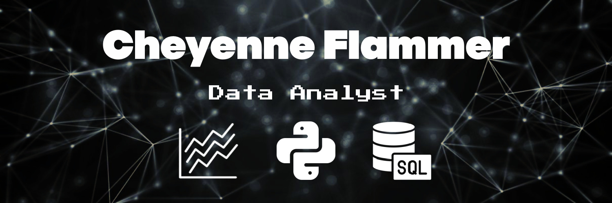

<!-- Header Img -->

<!-- Header -->
<h1 align="center">Hi I'm Cheyenne</h1>

<!-- About me -->
<h2 align="center">About me</h2>

Hello my name is Chey. I'm a graduate of Thinkfuls Software Engineering Program. Currently studying Data Science and Visualization at UCSD. I am a creative computer programmer dedicated to developing interactive, user-friendly, and feature-rich websites. I have a passion for analyzing and understanding big data. I have 1 year of experience in leveraging analytical skills and strong attention to detail in order to deliver original and efficient web solutions. Specializing in JavaScript, React, Data Analysis & Visualization with Tableau, Power Bi, and Microsoft SQL Tools. Currently studying Python with Jupyter notebook & D3! I can provide technical knowledge and expertise and build new websites from start to finish.

<!-- Tech Header -->

<h2 align="center">Tech</h2>

  

 

<!-- Tech Badges -->
<h3 align="center">Languages</h3>

  
  
  
  

<!-- Web Dev -->
<h3 align="center">Web Development</h3>

  
  
  
  
  

<!-- Tools -->
<h3 align="center">Tools</h3>

  
  
  
  
  
  
  
  

----
<h2 align="center">Github Stats</h2> 

  

<!-- Stat Cards -->

  
  

